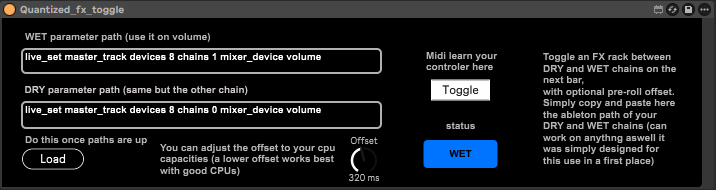
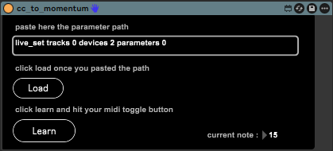

# Max for Live Devices

A growing collection of Max for Live patches designed for Ableton Live performance, MIDI control, workflow enhancement, audio experimentation, and custom interaction systems.

These devices are built around real-world usage inside live sets and studio sessions, with an emphasis on simplicity and immediate usability.

---

## Overview

This repository gathers a series of custom Max for Live devices developed to solve practical workflow and performance problems inside Ableton Live.

The first devices mainly focus on:
- improving live performance reliability,
- reshaping MIDI controller behavior,
- quantizing actions to musical timing,
- simplifying complex mappings,
- and creating interactions not natively available inside Ableton Live.

Over time, this collection is intended to expand toward:
- audio effects,
- instruments,
- MIDI generators,
- modulation tools,
- interaction systems with visual environments,
- and experimental performance utilities.

---

# Devices

---

## Quantized FX Toggle

### Description

This device allows switching between a **DRY** chain and a **WET** chain inside an Audio Effect Rack in a tempo-synced and quantized way.

Instead of activating effects immediately, the device waits for the next musical bar before switching states. This makes effect transitions significantly more reliable during live performance.

A smooth transition is applied between both states to preserve audio continuity and avoid clicks or abrupt changes.

Although originally designed for Audio Effect Racks containing two chains, the concept can naturally extend to any situation requiring quantized switching between two states or signal paths.

---

### Main Features

- Quantized switching on next bar
- Smooth transition between DRY and WET states
- Designed for live performance reliability
- Works with Ableton Live API paths
- Can control any parameter accessible through Live API
- Useful for master effects, reverbs, delays, transitions, and signal routing

---

### Usage

1. Insert the device inside Ableton Live.
2. Create an Audio Effect Rack with two chains:
   - DRY
   - WET
3. Copy the Live API paths of both chain volume parameters (right click on the chain's volume and copy path).
4. Paste them inside the device.
5. Press `Load`.
6. MIDI map the `Toggle` button to your controller.
7. Trigger the effect:
   - the state change will occur on the next bar,
   - with a smooth crossfade between both chains.

---

### Screenshot



---

## CC to Momentum

### Description

This device converts a MIDI button behaving like a toggle into a reliable **momentary control**.

Some MIDI controllers or Ableton mappings behave as toggles even when a temporary "press/release" interaction is desired. This patch recreates a proper momentary behavior by directly filtering MIDI note messages.

The device includes a simple learn system allowing the user to select the MIDI button to use.

This is particularly useful for:
- temporary effects,
- expressive live gestures,
- gated processing,
- transient FX activation,
- or any interaction where the effect should only stay active while holding a button.

---

### Main Features

- Converts toggle behavior into momentary behavior
- Integrated MIDI learn system
- Filters MIDI notes directly inside Max for Live
- Reliable press/release detection
- Designed for multi-controller live setups

---

### Usage

1. Insert the device inside Ableton Live.
2. Copy and paste the Live API path of the parameter to control.
3. Press `Load`.
4. Press `Learn`.
5. Press the MIDI button you want to assign.
6. The selected note is now stored inside the patch.
7. Holding the button activates the parameter.
8. Releasing the button deactivates it.

---

### Screenshot



---


# Project Structure

```text
.
├── README.md
├── /assets
│   ├── quantize_toggle.png
│   └── cc_to_momentum.png
└── /patches
    ├── quantize_toggle.amxd
    └── cc_to_momentum.amxd
```

---

# Requirements

- Ableton Live Suite
- Max for Live enabled
- Tested on Ableton Live 12

---

# Future Devices

This repository is intended to evolve with new patches covering:
- performance tools,
- audio effects,
- instruments,
- MIDI processing,
- synchronization systems,
- visual interaction tools,
- and experimental workflows.

